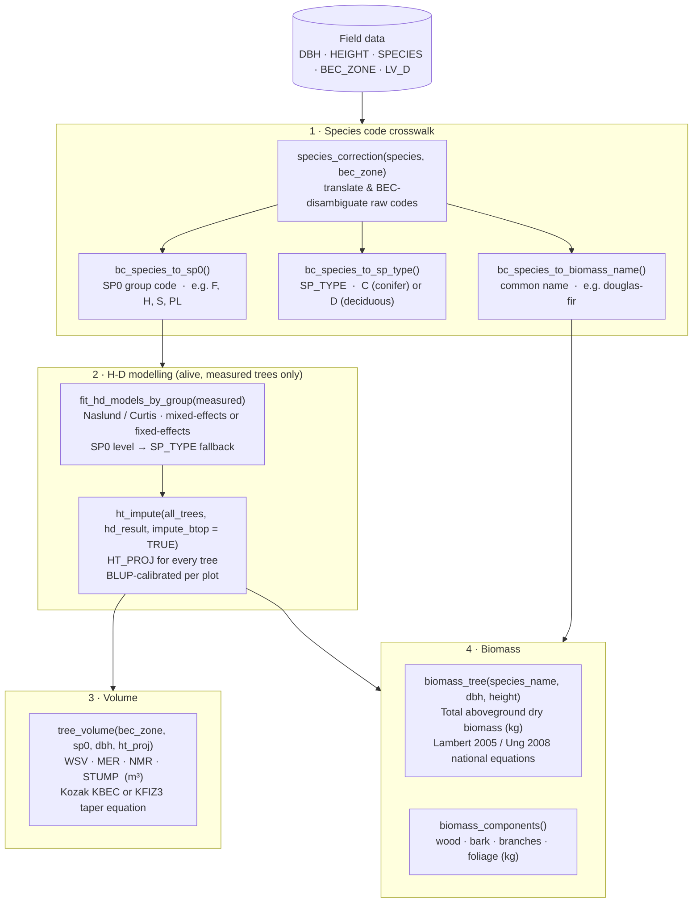

# CanWestAllometryCFS

<!-- badges: start -->
[](https://lifecycle.r-lib.org/articles/stages.html#experimental)
[](https://github.com/dfelixsattler/CanWestAllometryCFS/actions/workflows/R-CMD-check.yaml)
[](https://www.apache.org/licenses/LICENSE-2.0)
<!-- badges: end -->

An R package for tree-level calculation of H-D relationships and height
imputation, stem volume, and above-ground biomass, with an emphasis on
compatibility with BC Ministry of Forests' PSP and non-PSP field data.

Many of the package's functions were designed to replicate the BC Forest
Analysis and Inventory Branch's (FAIB) compilation routines for PSP and
non-PSP data, found in FAIBCompiler and FAIBBase. The current package
attempts to improve on the existing functions by (1) making them more
accessible through simplified functions and comprehensive vignettes,
(2) giving the user greater control over key decisions (e.g. model form
selection, broken-top tree handling, mixed- vs. fixed-effects fitting), and
(3) improving documentation.

While this package was designed with BC PSP and non-PSP data in mind, plot
data from other jurisdictions can also be used. The main requirement is that
column names in the user's dataset match those expected by the functions (or
that the relevant `_col` arguments are set to the correct column names).

## Installation

```r
# Install from GitHub
remotes::install_github("dfelixsattler/CanWestAllometryCFS")
```

## Data pipeline

The diagram below shows the end-to-end workflow from raw field data to
estimated heights, volumes, and biomass.



> **Notes**
> - Dead trees (`LV_D == "D"`) and broken-top trees (`BTOP == TRUE`) are
>   excluded from H-D model training but flow through to volume and biomass.
> - `impute_btop = TRUE` estimates total height for broken-top trees from DBH,
>   matching the BC MoF compilation routine.
> - Use `taper_eq = "KFIZ3"` with FIZ zone codes for pre-BEC inventory data.

## Quick start

```r
library(CanWestAllometryCFS)

trees <- psp_trees

# 1. Species crosswalk
trees$SPECIES_CORR    <- species_correction(trees$SPECIES, trees$BEC_ZONE)
trees$SPECIES_SP0     <- bc_species_to_sp0(trees$SPECIES_CORR)
trees$SPECIES_SP_TYPE <- bc_species_to_sp_type(trees$SPECIES_CORR)
trees$SPECIES_NAME    <- bc_species_to_biomass_name(trees$SPECIES, trees$BEC_ZONE)

# 2. Fit H-D models and impute heights
measured  <- trees[!is.na(trees$HEIGHT) & trees$LV_D == "L" & !trees$BTOP, ]
hd_result <- fit_hd_models_by_group(measured)
trees     <- ht_impute(trees, hd_result, impute_btop = TRUE)

# 3. Volume
trees$WSV_M3 <- tree_volume(trees$BEC_ZONE, trees$SPECIES_SP0,
                             trees$DBH, trees$HT_PROJ)

# 4. Biomass
trees$BIOMASS_KG <- biomass_tree(trees$SPECIES_NAME, trees$DBH,
                                  height = trees$HT_PROJ)
```

## Vignettes

| Vignette | Topic |
|---|---|
| `vignette("full_psp_workflow")` | End-to-end PSP workflow |
| `vignette("hd_psp_workflow")` | H-D modelling in depth |
| `vignette("biomass_psp_workflow")` | Biomass equations |
| `vignette("volume_psp_workflow")` | Kozak taper volume |

## Column reference

### Raw PSP data columns (inputs)

The data passed to the package functions should have, at minimum, the
following columns:

| Column | Description |
|---|---|
| `SITE_IDENTIFIER` | Plot/site identifier |
| `VISIT_NUMBER` | Measurement period (multi-year data) |
| `unitreeid` | Unique tree identifier across all visits |
| `SPECIES` | Raw BC inventory species code (e.g. `"PLI"`, `"FDI"`, `"HW"`) |
| `BEC_ZONE` | Biogeoclimatic Ecosystem Classification zone (e.g. `"SBS"`, `"CWH"`) |
| `DBH` | Diameter at breast height (cm) |
| `HEIGHT` | Measured total height (m); `NA` for unmeasured trees |
| `BTOP` | `TRUE` if the tree has a broken top |
| `LV_D` | Tree status: `"L"` = live, `"D"` = dead standing |

### Columns added by the package

| Column | Added by | Description |
|---|---|---|
| `SPECIES_CORR` | `species_correction()` | BEC-disambiguated species code |
| `SPECIES_SP0` | `bc_species_to_sp0()` | SP0 group code used by H-D and volume functions |
| `SPECIES_SP_TYPE` | `bc_species_to_sp_type()` | `"C"` (conifer) or `"D"` (deciduous); H-D fallback grouping |
| `SPECIES_NAME` | `bc_species_to_biomass_name()` | Common name used by biomass equations |
| `HT_PROJ` | `ht_impute()` | Filled height (m); measured or model-estimated |
| `HD_SOURCE` | `ht_impute()` | Source of the height value (e.g. `"measured"`, `"naslund_mixed-effects_sp0"`) |
| `HT_FLAG` | `ht_impute()` | QC flag (e.g. `"btop"` for broken-top trees) |

## How to Cite

If you use CanWestAllometryCFS in published work, please cite it as:

> Sattler, D. (2026). *CanWestAllometryCFS: Allometric Equations for British Columbia: Height–Diameter, Taper, Volume, and Biomass*. R package version 0.1.0. https://github.com/dfelixsattler/CanWestAllometryCFS

A machine-readable citation is also available in R via:

```r
citation("CanWestAllometryCFS")
```

## Acknowledgements

The allometric methods implemented in this package build on the work of
**Yong Luo** (BC Ministry of Forests) and the
[FAIBBase](https://github.com/bcgov/FAIBBase) and
[FAIBCompiler](https://github.com/bcgov/FAIBCompiler) packages.

## License

© His Majesty the King in Right of Canada, as represented by the Minister of
Natural Resources, 2026.

This package is distributed under the [Apache License 2.0](LICENSE).

Portions of this package are derived from
[FAIBBase](https://github.com/bcgov/FAIBBase) and
[FAIBCompiler](https://github.com/bcgov/FAIBCompiler),
© 2019 Province of British Columbia, which are themselves distributed under the
Apache License 2.0. Those portions remain subject to that license, and the
original copyright and attribution notices are retained here as required by
Section 4 of the Apache License 2.0.
